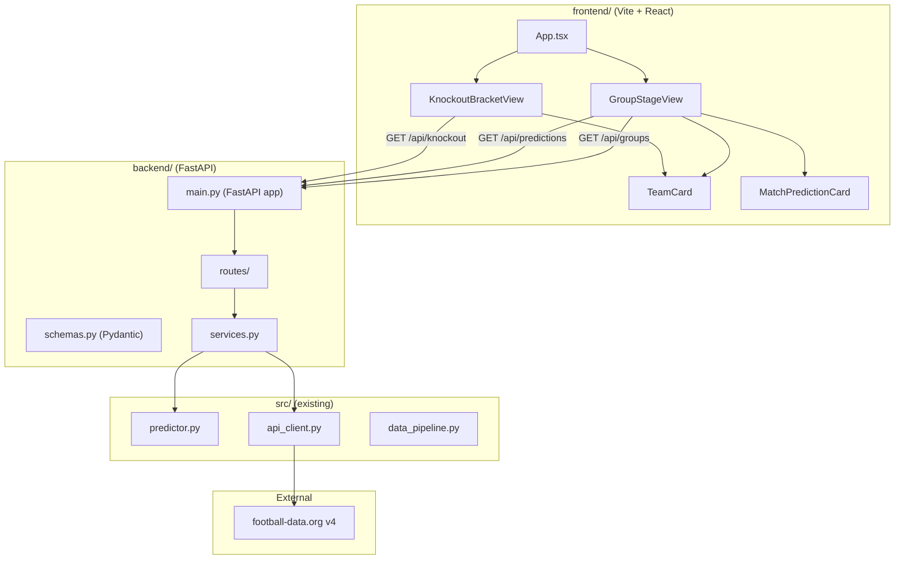

# Design Document: React Prediction Dashboard

## Overview

This design adds a full-stack web layer to the existing World Cup Predictor project. A **FastAPI backend** wraps the existing Python prediction engine and football-data.org API client, exposing structured REST endpoints. A **React frontend** (built with Vite) consumes those endpoints to render an interactive dashboard with group stage standings and knockout bracket views.

The architecture preserves the existing `src/` package unchanged and layers new code alongside it:
- `backend/` — FastAPI application with route handlers, data transformation, and configuration
- `frontend/` — Vite + React SPA with component-based UI

### Key Design Decisions

| Decision | Rationale |
|----------|-----------|
| Separate `backend/` directory (not inside `src/`) | Keeps the existing prediction engine untouched; clear boundary between ML pipeline and web layer |
| FastAPI over Flask/Django | Async-ready, automatic OpenAPI docs, Pydantic response models, lightweight |
| Vite over CRA | Faster builds, native ESM, smaller bundle, actively maintained |
| Tab-based navigation (not router) | Only two views, no deep-linking required — simpler state management |
| Backend transforms raw API data | Frontend stays thin; avoids duplicating football-data.org parsing logic |

## Architecture



### Request Flow

1. User opens the Dashboard → React app loads
2. Active tab triggers a `fetch()` to the Backend
3. FastAPI route handler delegates to a service layer
4. Service layer calls existing `Predictor.run()` or `APIClient` directly
5. Service transforms raw data into Pydantic response models
6. JSON response returned to frontend
7. React renders components from response data

## Components and Interfaces

### Backend Components

#### `backend/main.py` — Application Entry Point

- Creates the FastAPI application instance
- Configures CORS middleware (allows frontend dev server origin)
- Registers API routers
- Reads `FOOTBALL_DATA_API_KEY` from environment via `python-dotenv`

#### `backend/routes/groups.py` — Groups Router

```python
@router.get("/api/groups", response_model=GroupsResponse)
async def get_groups() -> GroupsResponse:
    """Fetch and return all World Cup 2026 groups."""
```

#### `backend/routes/predictions.py` — Predictions Router

```python
@router.get("/api/predictions", response_model=PredictionsResponse)
async def get_predictions() -> PredictionsResponse:
    """Run prediction engine and return match predictions."""
```

#### `backend/routes/knockout.py` — Knockout Router

```python
@router.get("/api/knockout", response_model=KnockoutResponse)
async def get_knockout() -> KnockoutResponse:
    """Fetch and return the knockout bracket structure."""
```

#### `backend/services.py` — Business Logic Layer

- `get_group_data()` — Calls `APIClient` to fetch standings for competition 2000, parses groups A-L
- `get_predictions()` — Instantiates `Predictor`, calls `run(2000)`, transforms DataFrame to list of dicts
- `get_knockout_data()` — Calls `APIClient` to fetch matches, filters knockout stage, organizes by round

#### `backend/schemas.py` — Pydantic Response Models

Defines typed response structures for all three endpoints (see Data Models section below).

### Frontend Components

#### `App.tsx` — Root Component

- Manages active tab state (`"groups"` | `"knockout"`)
- Renders tab navigation bar
- Conditionally renders `GroupStageView` or `KnockoutBracketView`
- Provides refresh button

#### `GroupStageView.tsx`

- Fetches `/api/groups` and `/api/predictions` on mount / tab switch
- Renders a responsive grid of group cards
- Each group card contains `TeamCard` components and `MatchPredictionCard` components

#### `KnockoutBracketView.tsx`

- Fetches `/api/knockout` on mount / tab switch
- Renders bracket structure organized by round columns
- Connects match slots visually between rounds

#### `TeamCard.tsx`

- Props: `teamName: string`, `crestUrl: string`
- Renders team crest image with `alt={teamName}`
- Falls back to a placeholder SVG icon when `crestUrl` is empty or image fails to load

#### `MatchPredictionCard.tsx`

- Props: `homeTeam`, `awayTeam`, `homeWinProb`, `homeLossProb`, `matchDate`
- Displays two team names with probabilities as percentages (1 decimal place)
- Highlights the favored team (higher probability) with a visual indicator
- Formats `matchDate` in locale-appropriate human-readable format

#### `api.ts` — API Client Module

```typescript
const API_BASE = import.meta.env.VITE_API_BASE || "http://localhost:8000";

export async function fetchGroups(): Promise<GroupsResponse> { ... }
export async function fetchPredictions(): Promise<PredictionsResponse> { ... }
export async function fetchKnockout(): Promise<KnockoutResponse> { ... }
```

## Data Models

### Backend Pydantic Schemas

```python
from pydantic import BaseModel

class Team(BaseModel):
    team_id: int
    team_name: str
    crest: str  # SVG URL or empty string

class Group(BaseModel):
    group_name: str  # "A" through "L"
    teams: list[Team]

class GroupsResponse(BaseModel):
    groups: list[Group]

class MatchPrediction(BaseModel):
    home_team_name: str
    away_team_name: str
    home_win_prob: float  # 0.0 to 1.0
    home_loss_prob: float  # 0.0 to 1.0
    home_team_crest: str
    away_team_crest: str
    match_date: str  # ISO 8601 format

class PredictionsResponse(BaseModel):
    predictions: list[MatchPrediction]

class KnockoutTeam(BaseModel):
    team_name: str  # "TBD" for undetermined
    crest: str  # empty string for undetermined

class KnockoutMatch(BaseModel):
    home_team: KnockoutTeam
    away_team: KnockoutTeam
    status: str  # SCHEDULED | TIMED | IN_PLAY | FINISHED
    home_score: int | None = None
    away_score: int | None = None

class KnockoutRound(BaseModel):
    round_name: str  # Round_of_32, Round_of_16, Quarter_Finals, Semi_Finals, Final
    matches: list[KnockoutMatch]

class KnockoutResponse(BaseModel):
    rounds: list[KnockoutRound]
```

### Frontend TypeScript Interfaces

```typescript
interface Team {
  team_id: number;
  team_name: string;
  crest: string;
}

interface Group {
  group_name: string;
  teams: Team[];
}

interface GroupsResponse {
  groups: Group[];
}

interface MatchPrediction {
  home_team_name: string;
  away_team_name: string;
  home_win_prob: number;
  home_loss_prob: number;
  home_team_crest: string;
  away_team_crest: string;
  match_date: string;
}

interface PredictionsResponse {
  predictions: MatchPrediction[];
}

interface KnockoutTeam {
  team_name: string;
  crest: string;
}

interface KnockoutMatch {
  home_team: KnockoutTeam;
  away_team: KnockoutTeam;
  status: string;
  home_score: number | null;
  away_score: number | null;
}

interface KnockoutRound {
  round_name: string;
  matches: KnockoutMatch[];
}

interface KnockoutResponse {
  rounds: KnockoutRound[];
}
```

### API Endpoint Summary

| Endpoint | Method | Response Model | Data Source |
|----------|--------|----------------|-------------|
| `/api/groups` | GET | `GroupsResponse` | football-data.org standings API |
| `/api/predictions` | GET | `PredictionsResponse` | `Predictor.run(2000)` |
| `/api/knockout` | GET | `KnockoutResponse` | football-data.org matches API (knockout stage filter) |


## Correctness Properties

*A property is a characteristic or behavior that should hold true across all valid executions of a system — essentially, a formal statement about what the system should do. Properties serve as the bridge between human-readable specifications and machine-verifiable correctness guarantees.*

### Property 1: Groups transformation produces complete team data

*For any* valid standings API response containing groups with teams, the `get_group_data()` service function SHALL return groups labeled A through L, each containing exactly 4 teams, where every team object includes a non-null `team_id`, `team_name`, and `crest` field.

**Validates: Requirements 1.2, 2.2, 2.3**

### Property 2: Predictions response preserves field completeness and sort order

*For any* non-empty DataFrame returned by `Predictor.run()`, the predictions transformation SHALL produce a list of prediction objects each containing `home_team_name`, `away_team_name`, `home_win_prob`, `home_loss_prob`, `home_team_crest`, `away_team_crest`, and `match_date`, and the list SHALL be sorted by `match_date` in ascending order.

**Validates: Requirements 1.3, 3.2, 3.3**

### Property 3: Probability values are bounded

*For any* prediction returned by the Backend, `home_win_prob` and `home_loss_prob` SHALL be floating-point numbers in the range [0.0, 1.0] inclusive.

**Validates: Requirements 3.4**

### Property 4: Knockout match team resolution

*For any* knockout match in the API response, if both home and away team IDs are present, the output SHALL include actual `team_name` and `crest` values; if either team ID is null or missing, the output SHALL use `"TBD"` for `team_name` and `""` for `crest`. Every match object SHALL include a `status` field.

**Validates: Requirements 4.3, 4.4, 4.5**

### Property 5: Finished knockout matches include scores

*For any* knockout match with `status == "FINISHED"`, the output SHALL include non-null `home_score` and `away_score` integer values. For any match with status other than `"FINISHED"`, `home_score` and `away_score` SHALL be null.

**Validates: Requirements 4.6**

### Property 6: API error mapping

*For any* error raised by the `APIClient` (including `AuthenticationError`, `RateLimitError`, and generic `APIError`), the Backend SHALL return an HTTP error response with a status code ≥ 400 and a JSON body containing a descriptive `detail` message.

**Validates: Requirements 1.6**

### Property 7: Probability percentage formatting

*For any* probability float value `p` where `0.0 ≤ p ≤ 1.0`, the `MatchPredictionCard` formatting function SHALL produce a string matching the pattern `"X.X%"` where the numeric portion equals `round(p * 100, 1)`.

**Validates: Requirements 9.1**

### Property 8: Favored team identification

*For any* match prediction where `home_win_prob ≠ home_loss_prob`, the `MatchPredictionCard` SHALL apply a visual distinction (CSS class or style) to the team with the higher win probability. When `home_win_prob > home_loss_prob`, the home team is favored; otherwise the away team is favored.

**Validates: Requirements 9.3**

## Error Handling

### Backend Error Strategy

| Error Source | Error Type | HTTP Response | Detail |
|---|---|---|---|
| football-data.org returns 401/403 | `AuthenticationError` | 502 Bad Gateway | "Upstream authentication failed" |
| football-data.org returns 429 | `RateLimitError` | 503 Service Unavailable | "Rate limit exceeded, try again later" |
| football-data.org returns other errors | `APIError` | 502 Bad Gateway | Original error message |
| football-data.org timeout | `APIError(408)` | 504 Gateway Timeout | "Upstream service timeout" |
| No training data available | `NoTrainingDataError` | 503 Service Unavailable | "Insufficient data for predictions" |
| Missing API key env var | Configuration error | 500 Internal Server Error | "Server configuration error" |
| Malformed API response | `KeyError`/`ValueError` | 502 Bad Gateway | "Invalid upstream response" |

### Backend Implementation

```python
from fastapi import HTTPException
from src.exceptions import AuthenticationError, RateLimitError, APIError, NoTrainingDataError

def handle_api_error(e: Exception) -> HTTPException:
    if isinstance(e, AuthenticationError):
        return HTTPException(status_code=502, detail="Upstream authentication failed")
    elif isinstance(e, RateLimitError):
        return HTTPException(status_code=503, detail="Rate limit exceeded, try again later")
    elif isinstance(e, APIError) and e.status_code == 408:
        return HTTPException(status_code=504, detail="Upstream service timeout")
    elif isinstance(e, APIError):
        return HTTPException(status_code=502, detail=str(e))
    elif isinstance(e, NoTrainingDataError):
        return HTTPException(status_code=503, detail="Insufficient data for predictions")
    else:
        return HTTPException(status_code=502, detail="Invalid upstream response")
```

### Frontend Error Strategy

- Network errors and non-2xx responses → display error banner with retry button
- Loading states → show spinner/skeleton without clearing existing content
- Image load failures → show fallback placeholder icon
- No need for granular error differentiation — user sees "Something went wrong, try again"

## Testing Strategy

### Backend Tests (pytest)

**Unit Tests:**
- Route handler tests using FastAPI `TestClient`
- Service function tests with mocked `APIClient` and `Predictor`
- Error handling tests covering each exception type mapping
- Edge cases: empty predictions, incomplete group data

**Property-Based Tests (Hypothesis):**
- Library: `hypothesis` (already in project dev dependencies)
- Minimum 100 iterations per property
- Each test tagged with: `Feature: react-prediction-dashboard, Property {N}: {title}`
- Properties 1–6 tested at the service/transformation layer with generated inputs
- Generators produce:
  - Random standings API responses (valid group structures)
  - Random prediction DataFrames matching `PREDICTION_COLUMNS` schema
  - Random knockout match data with various statuses and team combinations
  - Random API error instances

### Frontend Tests (Vitest + React Testing Library)

**Unit Tests:**
- Component rendering tests for `TeamCard`, `MatchPredictionCard`
- Tab navigation behavior
- Loading and error state rendering
- Accessibility checks (alt attributes, ARIA)

**Property-Based Tests (fast-check):**
- Library: `fast-check`
- Properties 7–8 tested in component/utility tests
- Generators produce random probability floats and team data
- Verify formatting correctness and favored team visual class application

### Test Configuration

```
backend/
  tests/
    test_services.py          # Unit tests for service layer
    test_routes.py            # FastAPI TestClient integration tests
    test_properties.py        # Property-based tests (Properties 1-6)
frontend/
  src/
    __tests__/
      App.test.tsx            # Tab navigation, loading, error states
      TeamCard.test.tsx       # Rendering, fallback, accessibility
      MatchPredictionCard.test.tsx  # Formatting, highlighting
      properties.test.ts     # Property-based tests (Properties 7-8)
```
