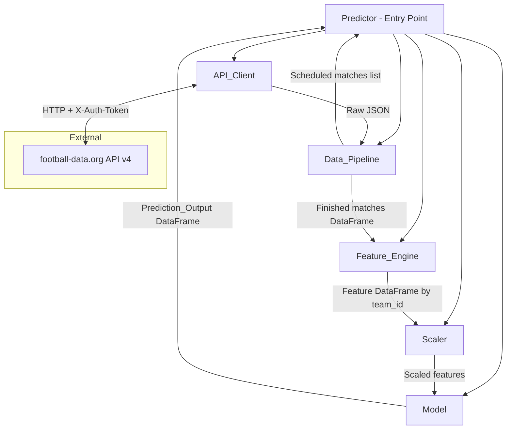

# Design Document: World Cup Predictor

## Overview

The World Cup Predictor is a Python-based machine learning system that predicts FIFA World Cup match outcomes using Logistic Regression. The system follows a pipeline architecture:

1. **Fetch** real-time match and team data from the [football-data.org v4 API](https://docs.football-data.org/general/v4/index.html)
2. **Parse** raw JSON responses into structured pandas DataFrames
3. **Compute** team performance features (win rate, goals scored, goals conceded)
4. **Scale** features using StandardScaler for normalization
5. **Train** a Logistic Regression classifier on completed match data
6. **Predict** binary outcomes (home win / not home win) for upcoming matches

The system is designed as a single-run pipeline invoked with a competition ID and API key, returning a DataFrame of prediction probabilities sorted by match date.

### Key Design Decisions

- **Binary classification over multiclass**: Draws are grouped with losses (label = 0) to simplify the prediction problem and improve model convergence with limited tournament data.
- **Logistic Regression**: Chosen for interpretability, fast training on small datasets, and well-calibrated probability outputs. Tournament data is inherently small (64 matches in a World Cup), so complex models would overfit.
- **StandardScaler preprocessing**: Ensures features with different scales (e.g., win rate 0–1 vs goals scored 0–5) contribute equally to the model.
- **Stateless pipeline**: Each invocation fetches fresh data and trains from scratch, avoiding stale model state across tournament rounds.

## Architecture

The system uses a layered pipeline architecture with clear separation of concerns.



### Data Flow

1. `Predictor.run(competition_id, api_key)` orchestrates the pipeline
2. `API_Client` fetches `/v4/competitions/{id}/matches` with authentication header
3. `Data_Pipeline` splits matches into finished (training) and scheduled (prediction)
4. `Feature_Engine` computes per-team statistics from finished matches
5. `Scaler` normalizes the feature matrix
6. `Model` trains on finished match features and predicts scheduled match outcomes

## Components and Interfaces

### API_Client

Handles all communication with the football-data.org REST API.

```python
class APIClient:
    def __init__(self, api_key: str, base_url: str = "https://api.football-data.org/v4"):
        """Initialize with API key for X-Auth-Token header."""

    def get_matches(self, competition_id: int, timeout: int = 60) -> dict:
        """
        Fetch all matches for a competition.
        
        Returns raw JSON dict from /v4/competitions/{competition_id}/matches.
        Raises APIError on failure, handles rate limiting with retries.
        """

    def _request_with_retry(self, url: str, max_retries: int = 3, timeout: int = 60) -> dict:
        """
        Execute GET request with rate-limit retry logic.
        
        Waits for rate limit window reset between attempts.
        Raises AuthenticationError for 401/403 without retrying.
        Raises RateLimitError after max retries exhausted.
        Raises APIError for other HTTP errors.
        """
```

### Data_Pipeline

Transforms raw API responses into structured DataFrames.

```python
class DataPipeline:
    def parse_matches(self, raw_response: dict) -> pd.DataFrame:
        """
        Parse raw API response into a DataFrame of finished matches.
        
        Returns DataFrame with columns:
            - home_team_id: int
            - away_team_id: int  
            - home_score: int
            - away_score: int
            - match_date: datetime
        
        Excludes matches with status != "FINISHED".
        Excludes matches with null/missing scores (logs warning).
        Returns empty DataFrame with correct schema if no finished matches.
        """

    def get_scheduled_matches(self, raw_response: dict) -> list[dict]:
        """
        Extract scheduled matches for prediction.
        
        Returns list of dicts with keys:
            - home_team_id: int
            - away_team_id: int
            - match_date: datetime
        """
```

### Feature_Engine

Computes team performance statistics from historical match data.

```python
class FeatureEngine:
    DEFAULT_WIN_RATE = 0.5
    DEFAULT_AVG_GOALS_SCORED = 0.0
    DEFAULT_AVG_GOALS_CONCEDED = 0.0

    def compute_features(self, matches_df: pd.DataFrame) -> pd.DataFrame:
        """
        Compute per-team features from historical match data.
        
        Returns DataFrame indexed by team_id with columns:
            - win_rate: float (wins / total_matches)
            - avg_goals_scored: float (total_goals_scored / total_matches)
            - avg_goals_conceded: float (total_goals_conceded / total_matches)
        
        Teams with zero matches get default values.
        """

    def get_match_features(
        self, home_team_id: int, away_team_id: int, features_df: pd.DataFrame
    ) -> pd.DataFrame:
        """
        Build a single-row feature vector for a match.
        
        Returns DataFrame with columns:
            - home_win_rate, home_avg_goals_scored, home_avg_goals_conceded
            - away_win_rate, away_avg_goals_scored, away_avg_goals_conceded
        
        Uses default values for teams not found in features_df.
        """
```

### Scaler

Wraps scikit-learn's StandardScaler with validation.

```python
class FeatureScaler:
    def __init__(self):
        self._scaler: StandardScaler | None = None
        self._is_fitted: bool = False
        self._n_features: int | None = None

    def fit_transform(self, features: pd.DataFrame) -> pd.DataFrame:
        """
        Fit scaler on training data and return transformed DataFrame.
        
        Preserves column names. Sets _is_fitted = True.
        Raises ValueError if features contain NaN values.
        """

    def transform(self, features: pd.DataFrame) -> pd.DataFrame:
        """
        Transform features using previously fitted parameters.
        
        Raises NotFittedError if not yet fitted.
        Raises ValueError if column count differs from training.
        Raises ValueError if features contain NaN values.
        """
```

### Model

Wraps scikit-learn's LogisticRegression with validation and prediction.

```python
class PredictionModel:
    MIN_TRAINING_SAMPLES = 10

    def __init__(self):
        self._model: LogisticRegression | None = None
        self._is_fitted: bool = False

    def train(self, features: pd.DataFrame, labels: pd.Series) -> None:
        """
        Train Logistic Regression on scaled features and binary labels.
        
        Labels: 1 = home win, 0 = home loss or draw.
        Raises InsufficientDataError if len(features) < 10.
        Raises SingleClassError if labels contain only one unique value.
        Raises ValueError if features contain NaN or infinite values.
        """

    def predict(self, features: pd.DataFrame) -> pd.DataFrame:
        """
        Predict probabilities for given feature vectors.
        
        Returns DataFrame with columns:
            - home_win_prob: float (0.0 to 1.0)
            - home_loss_prob: float (0.0 to 1.0)
        
        Probabilities sum to 1.0 per row.
        Raises NotFittedError if model has not been trained.
        """
```

### Predictor (Orchestrator)

```python
class Predictor:
    def __init__(self, api_key: str):
        """Initialize all pipeline components."""

    def run(self, competition_id: int) -> pd.DataFrame:
        """
        Execute full prediction pipeline.
        
        Returns DataFrame with columns:
            - home_team_id: int
            - away_team_id: int
            - home_win_prob: float
            - home_loss_prob: float
            - match_date: datetime
        
        Sorted by match_date ascending.
        Returns empty DataFrame if no scheduled matches.
        Raises NoTrainingDataError if no finished matches.
        Propagates errors from any pipeline step.
        """
```

## Data Models

### Match Record (Internal)

| Field | Type | Description |
|-------|------|-------------|
| home_team_id | int | Football-data.org team ID for home team |
| away_team_id | int | Football-data.org team ID for away team |
| home_score | int | Goals scored by home team (full time) |
| away_score | int | Goals scored by away team (full time) |
| match_date | datetime | UTC datetime of the match |

### Team Features (Internal)

| Field | Type | Range | Description |
|-------|------|-------|-------------|
| win_rate | float | [0.0, 1.0] | Ratio of wins to total matches |
| avg_goals_scored | float | [0.0, ∞) | Average goals scored per match |
| avg_goals_conceded | float | [0.0, ∞) | Average goals conceded per match |

### Match Feature Vector (Model Input)

| Field | Type | Description |
|-------|------|-------------|
| home_win_rate | float | Home team's win rate |
| home_avg_goals_scored | float | Home team's average goals scored |
| home_avg_goals_conceded | float | Home team's average goals conceded |
| away_win_rate | float | Away team's win rate |
| away_avg_goals_scored | float | Away team's average goals scored |
| away_avg_goals_conceded | float | Away team's average goals conceded |

### Prediction Output

| Field | Type | Range | Description |
|-------|------|-------|-------------|
| home_team_id | int | — | Home team identifier |
| away_team_id | int | — | Away team identifier |
| home_win_prob | float | [0.0, 1.0] | Probability of home team win |
| home_loss_prob | float | [0.0, 1.0] | Probability of home team loss/draw |
| match_date | datetime | — | Scheduled match date (UTC) |

### API Response Schema (External - football-data.org v4)

The system consumes the following fields from the `/v4/competitions/{id}/matches` endpoint:

```json
{
  "matches": [
    {
      "id": 330299,
      "utcDate": "2022-02-27T16:05:00Z",
      "status": "FINISHED | SCHEDULED | TIMED | ...",
      "homeTeam": { "id": 531, "name": "..." },
      "awayTeam": { "id": 516, "name": "..." },
      "score": {
        "fullTime": { "home": 1, "away": 1 }
      }
    }
  ]
}
```

## Correctness Properties

*A property is a characteristic or behavior that should hold true across all valid executions of a system — essentially, a formal statement about what the system should do. Properties serve as the bridge between human-readable specifications and machine-verifiable correctness guarantees.*

### Property 1: Data parsing preserves match information

*For any* valid API response containing finished matches with non-null scores, parsing the response into a DataFrame SHALL produce exactly one row per finished match, where each row's home_team_id, away_team_id, home_score, away_score, and match_date match the corresponding values from the input JSON, and matches with non-FINISHED status or null scores are excluded.

**Validates: Requirements 2.1, 2.2, 2.3, 2.4**

### Property 2: Feature computation correctness

*For any* DataFrame of match records, the Feature_Engine SHALL produce a features DataFrame where for each team: win_rate equals the team's number of wins divided by total matches played, avg_goals_scored equals total goals scored divided by total matches, and avg_goals_conceded equals total goals conceded divided by total matches — counting both home and away appearances.

**Validates: Requirements 3.1, 3.2, 3.3, 3.5**

### Property 3: Scaler normalization invariant

*For any* numeric DataFrame with at least 2 rows where at least one column has non-zero variance, after fit_transform the resulting DataFrame SHALL have each non-zero-variance column with mean within ±1e-7 of 0.0 and standard deviation within ±1e-7 of 1.0.

**Validates: Requirements 4.1**

### Property 4: Scaler transform preserves shape and column names

*For any* fitted Scaler and any prediction DataFrame with the same number of columns as the training data, transform SHALL return a DataFrame with identical column names and identical row count as the input.

**Validates: Requirements 4.2**

### Property 5: Scaler rejects column count mismatch

*For any* fitted Scaler trained on N columns, attempting to transform a DataFrame with M columns (where M ≠ N) SHALL raise a ValueError indicating feature shape mismatch.

**Validates: Requirements 4.4**

### Property 6: Scaler handles zero-variance columns

*For any* numeric DataFrame containing at least one column where all values are identical, fit_transform SHALL scale that column to all zeros without raising an error.

**Validates: Requirements 4.5**

### Property 7: Scaler rejects NaN values

*For any* DataFrame containing at least one NaN value, fit_transform or transform SHALL raise a ValueError indicating missing values.

**Validates: Requirements 4.6**

### Property 8: Prediction probabilities form a valid distribution

*For any* trained model and any valid feature vector, the predicted home_win_prob and home_loss_prob SHALL each be in the range [0.0, 1.0] and their sum SHALL equal 1.0.

**Validates: Requirements 5.3, 6.1**

### Property 9: Prediction output has correct shape

*For any* list of N upcoming matches provided for prediction, the Predictor SHALL produce a DataFrame with exactly N rows, each containing home_team_id, away_team_id, home_win_prob, and home_loss_prob columns.

**Validates: Requirements 6.2, 6.3**

### Property 10: Predictions are sorted by match date

*For any* set of prediction results with varying match dates, the output DataFrame SHALL be sorted by match_date in ascending order.

**Validates: Requirements 6.4**

### Property 11: Unknown teams receive default features

*For any* upcoming match referencing team IDs not present in the computed features DataFrame, the Predictor SHALL use default values (win_rate=0.5, avg_goals_scored=0.0, avg_goals_conceded=0.0) and still produce a valid Prediction_Output for that match.

**Validates: Requirements 6.6**

### Property 12: Training validation rejects invalid data

*For any* training dataset with fewer than 10 records, OR with labels containing only a single class, OR with features containing NaN/infinite values, the Model SHALL raise an appropriate error before training completes.

**Validates: Requirements 5.4, 5.5, 5.6**

### Property 13: Match classification by status

*For any* raw API response containing matches with mixed statuses, the Predictor SHALL route all FINISHED matches to the training set and all SCHEDULED matches to the prediction set, with no overlap between the two sets.

**Validates: Requirements 7.2**

### Property 14: API error responses include status code and message

*For any* HTTP error response with a status code ≥ 400, the API_Client SHALL raise an exception whose message contains both the numeric HTTP status code and the error message from the response body.

**Validates: Requirements 1.4**

## Error Handling

### Error Hierarchy

```python
class WorldCupPredictorError(Exception):
    """Base exception for all predictor errors."""

class APIError(WorldCupPredictorError):
    """Raised when the football-data.org API returns an error."""
    def __init__(self, status_code: int, message: str):
        self.status_code = status_code
        super().__init__(f"API error {status_code}: {message}")

class AuthenticationError(APIError):
    """Raised when the API key is invalid or expired (401/403)."""

class RateLimitError(APIError):
    """Raised when rate limit retries are exhausted (429)."""

class InsufficientDataError(WorldCupPredictorError):
    """Raised when training data is insufficient (<10 records or single class)."""

class SingleClassError(InsufficientDataError):
    """Raised when training labels contain only one class."""

class NotFittedError(WorldCupPredictorError):
    """Raised when Scaler or Model is used before fitting/training."""

class NoTrainingDataError(WorldCupPredictorError):
    """Raised when no finished matches are available for training."""
```

### Error Handling Strategy by Component

| Component | Error Condition | Behavior |
|-----------|----------------|----------|
| API_Client | HTTP 401/403 | Raise `AuthenticationError` immediately, no retry |
| API_Client | HTTP 429 | Wait for rate-limit reset, retry up to 3 times |
| API_Client | HTTP 429 × 3 | Raise `RateLimitError` |
| API_Client | HTTP 4xx/5xx (other) | Raise `APIError` with status code and message |
| API_Client | Timeout (>60s) | Raise `APIError` indicating timeout |
| Data_Pipeline | Null/missing scores | Exclude record, log warning with match ID |
| Data_Pipeline | No finished matches | Return empty DataFrame (not an error) |
| Feature_Engine | Team with 0 matches | Assign defaults (not an error) |
| Scaler | NaN in input | Raise `ValueError` |
| Scaler | Not fitted | Raise `NotFittedError` |
| Scaler | Column mismatch | Raise `ValueError` |
| Model | < 10 training records | Raise `InsufficientDataError` |
| Model | Single class labels | Raise `SingleClassError` |
| Model | NaN/inf in features | Raise `ValueError` |
| Model | Not trained | Raise `NotFittedError` |
| Predictor | No training data | Raise `NoTrainingDataError` |
| Predictor | No scheduled matches | Return empty DataFrame, log info |
| Predictor | Any step fails | Propagate exception to caller |

### Logging Strategy

- **WARNING**: Matches excluded due to null/missing scores (includes match ID)
- **INFO**: No scheduled matches found for prediction
- **DEBUG**: API request/response details, feature computation summaries
- Use Python's standard `logging` module with named logger per component

## Testing Strategy

### Testing Approach

This project uses a dual testing strategy combining example-based unit tests with property-based tests to achieve comprehensive coverage.

**Unit Tests** verify:
- Specific known examples with hand-computed expected results
- Edge cases (empty data, zero-variance features, minimum thresholds)
- Error conditions (authentication failures, timeouts, invalid inputs)
- Integration between components (with mocked external dependencies)

**Property-Based Tests** verify:
- Universal invariants that hold across all valid inputs
- Data transformation correctness across randomly generated inputs
- Mathematical guarantees (probability bounds, normalization invariants)
- Structural invariants (output shape, column presence, sorting)

### Technology Stack

- **Test framework**: pytest
- **Property-based testing**: [Hypothesis](https://hypothesis.readthedocs.io/)
- **Mocking**: unittest.mock (for API_Client external calls)
- **Coverage**: pytest-cov

### Property Test Configuration

- Minimum **100 examples** per property test (`@settings(max_examples=100)`)
- Each property test tagged with a comment: `# Feature: world-cup-predictor, Property {N}: {title}`
- Custom Hypothesis strategies for generating:
  - Valid match JSON responses
  - Match DataFrames with realistic score ranges
  - Feature DataFrames with bounded numeric values
  - Binary label Series with mixed classes

### Test Organization

```
tests/
├── conftest.py              # Shared fixtures and Hypothesis strategies
├── test_api_client.py       # API_Client unit tests (mocked HTTP)
├── test_data_pipeline.py    # Data_Pipeline unit + property tests
├── test_feature_engine.py   # Feature_Engine property tests
├── test_scaler.py           # Scaler property tests
├── test_model.py            # Model property tests
├── test_predictor.py        # Predictor integration tests
└── strategies.py            # Custom Hypothesis strategies
```

### Key Hypothesis Strategies

```python
# strategies.py
from hypothesis import strategies as st

# Generate a valid match record
match_record = st.fixed_dictionaries({
    "home_team_id": st.integers(min_value=1, max_value=10000),
    "away_team_id": st.integers(min_value=1, max_value=10000),
    "home_score": st.integers(min_value=0, max_value=15),
    "away_score": st.integers(min_value=0, max_value=15),
    "match_date": st.datetimes(),
})

# Generate a list of match records for a DataFrame
match_list = st.lists(match_record, min_size=1, max_size=50)

# Generate training data (>=10 records with both classes)
training_data = st.lists(match_record, min_size=10, max_size=100).filter(
    lambda matches: len(set(1 if m["home_score"] > m["away_score"] else 0 for m in matches)) > 1
)
```

### Coverage Goals

- **Line coverage**: ≥ 90% for all components
- **Branch coverage**: ≥ 85%
- **Property coverage**: Every correctness property has a corresponding Hypothesis test
- **Error path coverage**: Every documented error condition has a test

